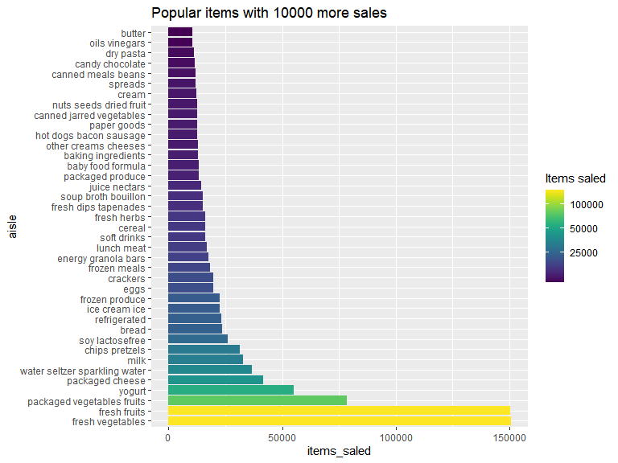
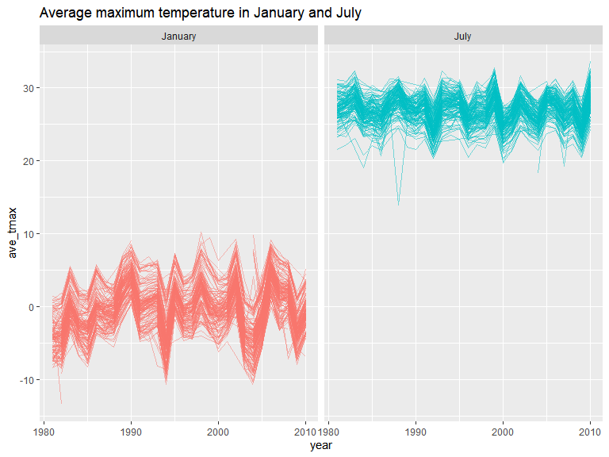

p8105_hw3_zj2357
================
Zekai Jin (zj2357)
2022-10-10

First of all, we should include the libraries we are using.

``` r
library(tidyverse)
library(lubridate)
library(forcats)
library(ggridges)
library(p8105.datasets)
knitr::opts_chunk$set(message  = FALSE,
                      warning = FALSE)
```

# Problem 1

``` r
data("instacart")
head(instacart,5)
```

    ## # A tibble: 5 × 15
    ##   order_id product_id add_to_c…¹ reord…² user_id eval_…³ order…⁴ order…⁵ order…⁶
    ##      <int>      <int>      <int>   <int>   <int> <chr>     <int>   <int>   <int>
    ## 1        1      49302          1       1  112108 train         4       4      10
    ## 2        1      11109          2       1  112108 train         4       4      10
    ## 3        1      10246          3       0  112108 train         4       4      10
    ## 4        1      49683          4       0  112108 train         4       4      10
    ## 5        1      43633          5       1  112108 train         4       4      10
    ## # … with 6 more variables: days_since_prior_order <int>, product_name <chr>,
    ## #   aisle_id <int>, department_id <int>, aisle <chr>, department <chr>, and
    ## #   abbreviated variable names ¹​add_to_cart_order, ²​reordered, ³​eval_set,
    ## #   ⁴​order_number, ⁵​order_dow, ⁶​order_hour_of_day

This dataset consists of 1384617 records, each redord represent an item
purchased by a user within an order. `order_id` shows that there are
131209 different orders. the other variables shows the time of the
order, the name of the item and their catagories.

To analyze the aisles, use the following code

``` r
aisle_group = 
  instacart %>%
  group_by(aisle) %>%
  summarise(n_obs =  n()) %>%
  arrange(-n_obs)
```

Thus, there are 134 different aisles. The most popular aisle is fresh
vegetables. Then, we make a plot of aisles with more than 10000 items
ordered.

``` r
aisle_group %>%
  mutate(aisle = fct_reorder(aisle, -n_obs)) %>%
  filter(n_obs > 10000) %>%
  ggplot(aes(x = n_obs,y = aisle,fill = n_obs)) +
  geom_col(orientation = "y") +
  xlab("items_saled") +
  viridis::scale_fill_viridis(trans = "log",
                              name = "Items saled",
                              breaks = c(25000,50000,100000)) +
  labs(title = "Popular items with 10000 more sales")
```

<!-- --> One
concern for this analysis is that there would be more than 1 of each
items within an order. However, the amount of items within an order is
not given. To make a table showing the three most popular items in these
isles, we have

``` r
instacart %>%
  filter(aisle %in% c("baking ingredients",
                      "dog food care",
                      "packaged vegetables fruits"
                      )
         ) %>%
  group_by(aisle, product_name) %>%
  summarise(n_obs = n()) %>%
  arrange(aisle, -n_obs) %>%
  summarise(
    popular_item = head(product_name, 3),
    n = head(n_obs, 3),
    rank = head(rank(-n_obs), 3)
  )
```

    ## # A tibble: 9 × 4
    ## # Groups:   aisle [3]
    ##   aisle                      popular_item                                n  rank
    ##   <chr>                      <chr>                                   <int> <dbl>
    ## 1 baking ingredients         Light Brown Sugar                         499     1
    ## 2 baking ingredients         Pure Baking Soda                          387     2
    ## 3 baking ingredients         Cane Sugar                                336     3
    ## 4 dog food care              Snack Sticks Chicken & Rice Recipe Dog…    30     1
    ## 5 dog food care              Organix Chicken & Brown Rice Recipe        28     2
    ## 6 dog food care              Small Dog Biscuits                         26     3
    ## 7 packaged vegetables fruits Organic Baby Spinach                     9784     1
    ## 8 packaged vegetables fruits Organic Raspberries                      5546     2
    ## 9 packaged vegetables fruits Organic Blueberries                      4966     3

And to make a table showing the mean hour of the day, use the folliwing
code:

``` r
instacart %>%
  filter(product_name %in% c("Pink Lady Apples", "Coffee Ice Cream")) %>%
  group_by(
    product_name,
    order_dow
  ) %>%
  summarise(
    mean_hour = mean(order_hour_of_day)
  ) %>%
  pivot_wider(
    names_from = "order_dow",
    values_from = "mean_hour",
    names_prefix = "day "
  )
```

    ## # A tibble: 2 × 8
    ## # Groups:   product_name [2]
    ##   product_name     `day 0` `day 1` `day 2` `day 3` `day 4` `day 5` `day 6`
    ##   <chr>              <dbl>   <dbl>   <dbl>   <dbl>   <dbl>   <dbl>   <dbl>
    ## 1 Coffee Ice Cream    13.8    14.3    15.4    15.3    15.2    12.3    13.8
    ## 2 Pink Lady Apples    13.4    11.4    11.7    14.2    11.6    12.8    11.9

# Problem 2

First, we should tidy the dataset:

``` r
rm(list = ls())
accel_df = read_csv("data/accel_data.csv") %>%
  pivot_longer(
    activity.1:activity.1440,
    names_to = "minute",
    names_prefix = "activity.",
    values_to = "activity"
  ) %>%
  mutate(
    minute = as.integer(minute),
    weekends = day %in% c("Saturday","Sunday"),
    day = factor(day,levels = c("Sunday", "Monday", "Tuesday", "Wednesday", "Thursday", "Friday", "Saturday"))
  ) %>%
  select(day_id, week, day, weekends, minute, activity)
  
head(accel_df,5)
```

    ## # A tibble: 5 × 6
    ##   day_id  week day    weekends minute activity
    ##    <dbl> <dbl> <fct>  <lgl>     <int>    <dbl>
    ## 1      1     1 Friday FALSE         1     88.4
    ## 2      1     1 Friday FALSE         2     82.2
    ## 3      1     1 Friday FALSE         3     64.4
    ## 4      1     1 Friday FALSE         4     70.0
    ## 5      1     1 Friday FALSE         5     75.0

Thus, the reasulting dataframe `accel_df` consists of $5*7*24*60=50400$
records. Each record contains activity of the male during a minute’s
period of time, stored in variable `activity`. Other varibles in the
record shows information for the one-minute time period. The following
code creates a tgable for the total activity for each day, and made a
plot.

``` r
accel_df %>%
  group_by(day_id) %>%
  summarise(total_activity = sum(activity))
```

    ## # A tibble: 35 × 2
    ##    day_id total_activity
    ##     <dbl>          <dbl>
    ##  1      1        480543.
    ##  2      2         78828.
    ##  3      3        376254 
    ##  4      4        631105 
    ##  5      5        355924.
    ##  6      6        307094.
    ##  7      7        340115.
    ##  8      8        568839 
    ##  9      9        295431 
    ## 10     10        607175 
    ## # … with 25 more rows

``` r
accel_df %>%
  group_by(day_id) %>%
  summarise(total_activity = sum(activity)) %>%
  ggplot(aes(x = day_id, y = total_activity)) +
  geom_point() +
  labs(title = "Total activity every day")
```

<!-- -->
Thus, no apparant trends can be seen under this analysis, except for
some days having almost zero activity. However, it is notable that the
`day_id` does not represent days after study begins. To solve this
problem, use the following code

``` r
accel_df %>%
  group_by(week,day) %>%
  summarise(total_activity = sum(activity)) %>%
  mutate(
    day = as.integer(day),
    week = as.factor(week)
  ) %>%
  ggplot(aes(x = day, y = total_activity, color = week)) +
  geom_line() +
  scale_x_continuous(breaks = 1:7,
                     labels = c("Sunday", "Monday", "Tuesday", "Wednesday", "Thursday", "Friday", "Saturday")) +
  labs(title = "Total activity every day")
```

<!-- --> From
the figure, the activity is more stable from Tuesday to Friday, and have
more variance on Sunday and Mondays. The activity on Saturday is not
reliable due to missing data for two days. However, it is likely that
missing data is encoded as 1, thus the `total_activity` here should be
lower than the true value. This could be solved by encoding 1 as `NA`
and analyze based on `mean(activity)`.

to make a single-panel plot that shows the 24-hour activity time courses
for each day, use the following code:

``` r
accel_df %>%
  mutate(day_id = as.factor(day_id),
         week = as.factor(week),
         hour = minute / 60) %>%
  group_by(day_id) %>%
  ggplot(aes(x = hour, y = activity, group = day_id, color = day)) +
  geom_smooth(se = FALSE, method = "loess", span = 0.5) +
  scale_x_continuous(breaks = 0:12 * 2) +
  labs(title = "Activity course every day")
```

<!-- --> This
plot shows that the males tends to exercise in the morning between 5-11
a.m. and in the evening between 18-22 p.m. He seldom move during
midnight, and reduced activity at noon. Meanwhile, his exercise on each
day across week showed similar pattern. For example, in 4 out of 5
weeks, the man exercised in the evening on Friday (purple lines).

# Problem 3

First of all, clean the data using the following code:

``` r
rm(list = ls())
data("ny_noaa")
ny_noaa = ny_noaa %>%
  mutate(
    id = as.factor(id),
    year = year(date),
    month = factor(month.name[month(date, label = TRUE)], levels = month.name),
    day = day(date),
    prcp = as.double(prcp) / 10,
    tmax = as.double(tmax) / 10,
    tmin = as.double(tmin) / 10
    ) %>%
  select(id, date, year, month, day, everything()) %>%
  arrange(date)
```

The dataframe consists of 2595176 records from 747 weather stations,
lasting from \`1981-01-01 to 2010-12-31. For each record, there are
information for the Precipitation, Snowfall, Snow depth(mm) and
Maximum/minimum Temperature$(^oC)$ information.

We can count the frequency based on the following code:

``` r
ny_noaa %>%
  group_by(snow) %>%
  summarise(n_obs = n()) %>%
  arrange(-n_obs) %>%
  head(3)
```

    ## # A tibble: 3 × 2
    ##    snow   n_obs
    ##   <int>   <int>
    ## 1     0 2008508
    ## 2    NA  381221
    ## 3    25   31022

Because most days don’t snow, the most frequent value is 0, indicating
no snows.

The code below makes a two-panel plot showing the average max
temperature in January and in July. Each line represents a record from a
different station.

``` r
ny_noaa %>%
  subset(month %in% c("January", "July")) %>%
  group_by(year, month, id) %>%
  summarise(
    ave_tmax = mean(tmax, na.rm = TRUE),
  ) %>%
  ggplot() +
  geom_line(aes(x = year, y = ave_tmax,group = id, color = month), alpha = 0.5) +
  facet_grid(~month) +
  theme(legend.position = "none") +
  labs(title = "Average maximum temperature in January and July")
```

<!-- -->
From the figure, it is obvious that the average maximum temperature in
July is always higher than in January, regardless of station and year.
Meanwhile, the average maximum temperature from different stations tend
to increase or drop together. During cold months, the record of all
stations decreases to a similar extent, forming parallel lines in the
figure. However, there are some notable outliers not following this
pattern, such as the dip in July, 1988.

The code to make the two panel plot and the result is shown below.
Considering the computational efficiency and differences across
stations, take the average temperature between stations will have a
better plot.

``` r
ny_noaa %>%
  mutate(day_of_year = yday(date),
         year = as.factor(year)) %>%
  group_by(year, day_of_year) %>%
  summarise(ave_tmax = mean(tmax, na.rm = TRUE),
            ave_tmin = mean(tmin, na.rm = TRUE)) %>%
  pivot_longer(ave_tmax:ave_tmin,
               names_to = "t_type",
               values_to = "tempreture",
               names_prefix = "ave_") %>%
  ggplot(aes(x = day_of_year, y = tempreture , group = year, color = t_type)) +
  geom_line(alpha = 0.3) +
  facet_grid(~t_type)
```

<!-- -->

``` r
ny_noaa %>%
  filter(snow > 0 & snow < 100) %>%
  mutate(year = as.factor(year)) %>%
  ggplot(aes(x = snow, y = year, fill = year)) +
  geom_density_ridges(scale = 1.5, alpha = 0.5, color = "#0000005F") +
  scale_x_continuous(limit = c(0, 100))
```

<!-- -->
