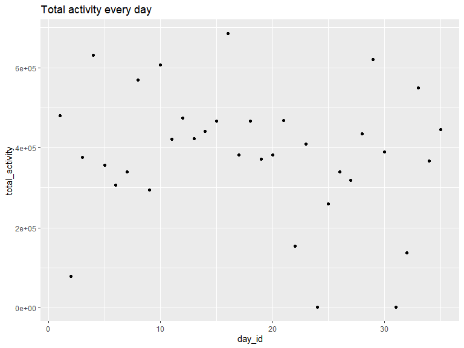

p8105_hw3_zj2357
================
Zekai Jin (zj2357)
2022-10-10

First of all, we should include the libraries we are using.

``` r
library(tidyverse)
library(p8105.datasets)
library(lubridate)
library(patchwork)
library(forcats)
library(ggridges)
```

# Problem 1

``` r
data("instacart")
aisle_group = 
  instacart %>%
  group_by(aisle) %>%
  summarise(n_obs =  n()) %>%
  arrange(-n_obs)
```

Thus, there are 134 different aisles. The most popular aisle is fresh
vegetables. Then, we make a plot of aisles with more than 10000 items
ordered.

``` r
aisle_group %>%
  mutate(aisle=fct_reorder(aisle,-n_obs)) %>%
  filter(n_obs > 10000) %>%
  ggplot(aes(x = n_obs,y = aisle,fill=n_obs)) +
  geom_col(orientation="y") +
  xlab("items_saled") +
  viridis::scale_fill_viridis(trans = "log",
                              name = "Items saled",
                              breaks = c(25000,50000,100000)) 
```

<!-- --> The
three most popular items in these isles are

``` r
instacart %>%
  filter(aisle %in% c("baking ingredients",
                      "dog food care",
                      "packaged vegetables fruits"
                      )
         ) %>%
  group_by(aisle, product_name) %>%
  summarise(
    n_obs=n()
  ) %>%
  arrange(aisle,-n_obs) %>%
  summarise(
    popular_item = head(product_name,3),
    n = head(n_obs,3),
    rank = head(rank(-n_obs),3)
  )
```

    ## # A tibble: 9 × 4
    ## # Groups:   aisle [3]
    ##   aisle                      popular_item                                n  rank
    ##   <chr>                      <chr>                                   <int> <dbl>
    ## 1 baking ingredients         Light Brown Sugar                         499     1
    ## 2 baking ingredients         Pure Baking Soda                          387     2
    ## 3 baking ingredients         Cane Sugar                                336     3
    ## 4 dog food care              Snack Sticks Chicken & Rice Recipe Dog…    30     1
    ## 5 dog food care              Organix Chicken & Brown Rice Recipe        28     2
    ## 6 dog food care              Small Dog Biscuits                         26     3
    ## 7 packaged vegetables fruits Organic Baby Spinach                     9784     1
    ## 8 packaged vegetables fruits Organic Raspberries                      5546     2
    ## 9 packaged vegetables fruits Organic Blueberries                      4966     3

``` r
instacart %>%
  filter(product_name == "Pink Lady Apples" |
         product_name == "Coffee Ice Cream"
         ) %>%
  group_by(product_name,order_dow) %>%
  summarise(
    mean_hour = mean(order_hour_of_day)
  ) %>%
  pivot_wider(names_from = "order_dow",
              values_from = "mean_hour",
              names_prefix = "day ")
```

    ## # A tibble: 2 × 8
    ## # Groups:   product_name [2]
    ##   product_name     `day 0` `day 1` `day 2` `day 3` `day 4` `day 5` `day 6`
    ##   <chr>              <dbl>   <dbl>   <dbl>   <dbl>   <dbl>   <dbl>   <dbl>
    ## 1 Coffee Ice Cream    13.8    14.3    15.4    15.3    15.2    12.3    13.8
    ## 2 Pink Lady Apples    13.4    11.4    11.7    14.2    11.6    12.8    11.9

# Problem 2

``` r
rm(list = ls())
accel_df = read_csv("data/accel_data.csv") %>%
  pivot_longer(
    activity.1:activity.1440,
    names_to = "minute",
    names_prefix = "activity.",
    values_to = "activity"
  ) %>%
  mutate(
    minute = as.integer(minute),
    weekends = day %in% c("Saturday","Sunday")
  )
```

    ## Rows: 35 Columns: 1443
    ## ── Column specification ────────────────────────────────────────────────────────
    ## Delimiter: ","
    ## chr    (1): day
    ## dbl (1442): week, day_id, activity.1, activity.2, activity.3, activity.4, ac...
    ## 
    ## ℹ Use `spec()` to retrieve the full column specification for this data.
    ## ℹ Specify the column types or set `show_col_types = FALSE` to quiet this message.

``` r
accel_df
```

    ## # A tibble: 50,400 × 6
    ##     week day_id day    minute activity weekends
    ##    <dbl>  <dbl> <chr>   <int>    <dbl> <lgl>   
    ##  1     1      1 Friday      1     88.4 FALSE   
    ##  2     1      1 Friday      2     82.2 FALSE   
    ##  3     1      1 Friday      3     64.4 FALSE   
    ##  4     1      1 Friday      4     70.0 FALSE   
    ##  5     1      1 Friday      5     75.0 FALSE   
    ##  6     1      1 Friday      6     66.3 FALSE   
    ##  7     1      1 Friday      7     53.8 FALSE   
    ##  8     1      1 Friday      8     47.8 FALSE   
    ##  9     1      1 Friday      9     55.5 FALSE   
    ## 10     1      1 Friday     10     43.0 FALSE   
    ## # … with 50,390 more rows

``` r
accel_df %>%
  group_by(day_id) %>%
  summarise(total_activity = sum(activity))
```

    ## # A tibble: 35 × 2
    ##    day_id total_activity
    ##     <dbl>          <dbl>
    ##  1      1        480543.
    ##  2      2         78828.
    ##  3      3        376254 
    ##  4      4        631105 
    ##  5      5        355924.
    ##  6      6        307094.
    ##  7      7        340115.
    ##  8      8        568839 
    ##  9      9        295431 
    ## 10     10        607175 
    ## # … with 25 more rows

``` r
accel_df %>%
  mutate(day_id = as.factor(day_id),
         week = as.factor(week),
         day = factor(day,levels = c("Sunday", "Monday", "Tuesday", "Wednesday", "Thursday", "Friday", "Saturday")),
         hour = minute/60) %>%
  group_by(day_id) %>%
  ggplot(aes(x = hour, y = activity, group = day_id, color = day)) +
  geom_smooth(se = FALSE,method = "loess",span=0.4 ) +
  scale_x_continuous(breaks=0:12*2) 
```

    ## `geom_smooth()` using formula 'y ~ x'

<!-- -->

# Problem 3

``` r
rm(list = ls())
data("ny_noaa")
ny_noaa = ny_noaa %>%
  mutate(
    id = as.factor(id),
    year = year(date),
    month = factor(month.name[month(date,label=TRUE)],levels=month.name),
    day = day(date),
    prcp = as.double(prcp)/10,
    tmax = as.double(tmax)/10,
    tmin = as.double(tmin)/10
    ) %>%
  select(id,date,year,month,day,everything()) %>%
  arrange(date)

ny_noaa %>%
  group_by(snow) %>%
  summarise(n_obs = n()) %>%
  arrange(-n_obs) %>%
  head(3)
```

    ## # A tibble: 3 × 2
    ##    snow   n_obs
    ##   <int>   <int>
    ## 1     0 2008508
    ## 2    NA  381221
    ## 3    25   31022

``` r
ny_noaa %>%
  subset(month %in% c("January","July")) %>%
  group_by(year,month,id) %>%
  summarise(
    ave_tmax = mean(tmax,na.rm=TRUE),
  ) %>%
  ggplot() +
  geom_line(aes(x=year,y=ave_tmax,group = id,color = month),alpha = 0.5) +
  facet_grid(~month) +
  theme(legend.position = "none") 
```

    ## `summarise()` has grouped output by 'year', 'month'. You can override using the
    ## `.groups` argument.

    ## Warning: Removed 5640 row(s) containing missing values (geom_path).

<!-- -->

``` r
  ny_noaa %>%
  mutate(day_of_year=yday(date),
         year = as.factor(year)) %>%
  ggplot() +
  geom_smooth(aes(x=day_of_year,y=tmax,color=year))
```

    ## `geom_smooth()` using method = 'gam' and formula 'y ~ s(x, bs = "cs")'

    ## Warning: Removed 1134358 rows containing non-finite values (stat_smooth).

<!-- -->

``` r
ny_noaa %>%
  mutate(day_of_year=yday(date),
         year = as.factor(year)) %>%
  group_by(year,day_of_year) %>%
  summarise(ave_tmax = mean(tmax, na.rm = TRUE),
            ave_tmin = mean(tmin, na.rm = TRUE))%>%
  pivot_longer(ave_tmax:ave_tmin,
               names_to = "t_type",
               values_to = "tempreture",
               names_prefix = "ave_") %>%
  ggplot(aes(x=day_of_year, y= tempreture , group = year, color = t_type)) +
  geom_line(alpha = 0.3) +
  facet_grid(~t_type)
```

    ## `summarise()` has grouped output by 'year'. You can override using the
    ## `.groups` argument.

<!-- -->

``` r
ny_noaa %>%
  filter(snow > 0 & snow < 100) %>%
  mutate(year = as.factor(year)) %>%
  ggplot(aes(x=snow,y=year,fill = year)) +
  geom_density_ridges(scale=1.5,alpha=0.5,color="#0000005F") +
  scale_x_continuous(limit = c(0,100))
```

    ## Picking joint bandwidth of 3.76

<!-- -->
